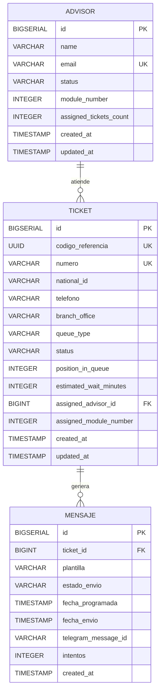

# BASE DE DATOS - Sistema Ticketero Digital

## Descripción del Modelo Lógico de Datos

El Sistema Ticketero Digital utiliza un modelo relacional diseñado para gestionar eficientemente la atención de clientes en sucursales bancarias. El modelo está optimizado para operaciones de alta concurrencia y consultas en tiempo real.

### Arquitectura de Datos
- **Motor de Base de Datos**: PostgreSQL
- **Estrategia de Identificadores**: BIGSERIAL para claves primarias
- **Versionamiento**: Flyway para migraciones controladas
- **Indexación**: Índices estratégicos para consultas frecuentes

## Modelo de Datos



## Entidades Principales y su Propósito

### 1. Ticket
**Propósito**: Entidad central que representa un turno de atención en sucursal.

**Campos principales**:
- `id`: Identificador único interno (BIGSERIAL)
- `codigo_referencia`: UUID para referencias externas
- `numero`: Número visible del ticket (C01, P15, E03, G02)
- `national_id`: Identificación del cliente
- `telefono`: Teléfono para notificaciones Telegram
- `branch_office`: Sucursal donde se generó el ticket
- `queue_type`: Tipo de cola (CAJA, PERSONAL_BANKER, EMPRESAS, GERENCIA)
- `status`: Estado actual del ticket
- `position_in_queue`: Posición actual en la cola
- `estimated_wait_minutes`: Tiempo estimado de espera
- `assigned_advisor_id`: Asesor asignado (FK)
- `assigned_module_number`: Módulo de atención asignado

**Estados posibles**:
- `EN_ESPERA`: Esperando asignación
- `PROXIMO`: Próximo a ser atendido (posición ≤ 3)
- `ATENDIENDO`: Siendo atendido por un asesor
- `COMPLETADO`: Atención finalizada
- `CANCELADO`: Cancelado por cliente o sistema
- `NO_ATENDIDO`: Cliente no se presentó

### 2. Mensaje
**Propósito**: Gestiona las notificaciones programadas vía Telegram.

**Campos principales**:
- `id`: Identificador único (BIGSERIAL)
- `ticket_id`: Referencia al ticket (FK)
- `plantilla`: Tipo de mensaje (TOTEM_TICKET_CREADO, TOTEM_PROXIMO_TURNO, TOTEM_ES_TU_TURNO)
- `estado_envio`: Estado del envío (PENDIENTE, ENVIADO, FALLIDO)
- `fecha_programada`: Cuándo debe enviarse
- `fecha_envio`: Cuándo se envió realmente
- `telegram_message_id`: ID del mensaje en Telegram
- `intentos`: Cantidad de reintentos

### 3. Advisor
**Propósito**: Representa los asesores/ejecutivos que atienden clientes.

**Campos principales**:
- `id`: Identificador único (BIGSERIAL)
- `name`: Nombre completo del asesor
- `email`: Email único del asesor
- `status`: Estado actual (AVAILABLE, BUSY, OFFLINE)
- `module_number`: Número de módulo asignado (1-5)
- `assigned_tickets_count`: Cantidad de tickets actualmente asignados

## Relaciones entre Entidades

### Ticket ↔ Advisor (Many-to-One)
- **Cardinalidad**: Un asesor puede tener múltiples tickets asignados, pero un ticket solo puede tener un asesor
- **Restricción de negocio**: Un asesor puede tener máximo 1 ticket en estado `ATENDIENDO` simultáneamente
- **Clave foránea**: `ticket.assigned_advisor_id → advisor.id`
- **Comportamiento**: ON DELETE SET NULL (si se elimina asesor, tickets quedan sin asignar)

### Ticket ↔ Mensaje (One-to-Many)
- **Cardinalidad**: Un ticket puede tener múltiples mensajes programados
- **Clave foránea**: `mensaje.ticket_id → ticket.id`
- **Comportamiento**: ON DELETE CASCADE (si se elimina ticket, se eliminan sus mensajes)

## Reglas de Integridad y Consistencia

### Restricciones de Dominio
1. **Números de ticket únicos**: Formato específico por tipo de cola (C01, P15, E03, G02)
2. **Módulos válidos**: Solo números 1-5 para asesores
3. **Estados válidos**: Solo valores definidos en enums
4. **Contadores no negativos**: `assigned_tickets_count ≥ 0`

### Restricciones de Integridad Referencial
1. **Ticket → Advisor**: FK con SET NULL para permitir tickets sin asesor
2. **Mensaje → Ticket**: FK con CASCADE para eliminar mensajes huérfanos

### Reglas de Negocio Implementadas
1. **Concurrencia de atención**: Un asesor solo puede atender un cliente a la vez
2. **Unicidad de referencias**: Cada ticket tiene UUID único para integraciones externas
3. **Trazabilidad temporal**: Timestamps automáticos en creación y actualización
4. **Reintentos controlados**: Límite de intentos para envío de mensajes

## Índices para Performance

### Índices en Ticket
```sql
CREATE INDEX idx_ticket_status ON ticket(status);
CREATE INDEX idx_ticket_national_id ON ticket(national_id);
CREATE INDEX idx_ticket_queue_type ON ticket(queue_type);
CREATE INDEX idx_ticket_created_at ON ticket(created_at DESC);
```

### Índices en Mensaje
```sql
CREATE INDEX idx_mensaje_estado_fecha ON mensaje(estado_envio, fecha_programada);
CREATE INDEX idx_mensaje_ticket_id ON mensaje(ticket_id);
```

### Índices en Advisor
```sql
CREATE INDEX idx_advisor_status ON advisor(status);
CREATE INDEX idx_advisor_module ON advisor(module_number);
```

## Versionamiento de Base de Datos (Flyway)

### Herramienta de Migración
El sistema utiliza **Flyway** como herramienta de migración de base de datos, proporcionando:
- Control de versiones del esquema
- Migraciones reproducibles
- Rollback controlado
- Trazabilidad completa de cambios

### Convención de Versionado
Las migraciones siguen el patrón: `V{VERSION}__{DESCRIPTION}.sql`

Donde:
- `VERSION`: Número secuencial (1, 2, 3, ...)
- `DESCRIPTION`: Descripción funcional en inglés con guiones bajos

### Migraciones Existentes

#### V1__create_ticket_table.sql
**Propósito**: Creación de la tabla principal `ticket`
**Funcionalidad**:
- Define la estructura base para gestión de turnos
- Establece constraints de unicidad para `codigo_referencia` y `numero`
- Crea índices para consultas frecuentes por estado, cliente y fecha
- Incluye campos de auditoría (`created_at`, `updated_at`)

**Relación con dominio**: Implementa la entidad central del sistema de turnos

#### V2__create_mensaje_table.sql
**Propósito**: Sistema de notificaciones programadas
**Funcionalidad**:
- Crea tabla para gestionar mensajes Telegram
- Establece relación con tickets mediante FK con CASCADE
- Índices optimizados para el scheduler de mensajes
- Control de reintentos y estados de envío

**Relación con dominio**: Habilita las notificaciones automáticas a clientes

#### V3__create_advisor_table.sql
**Propósito**: Gestión de asesores y asignación de tickets
**Funcionalidad**:
- Define estructura para asesores/ejecutivos
- Establece constraints para módulos válidos (1-5)
- Crea FK bidireccional con tabla ticket
- Inserta datos iniciales de 5 asesores
- Controla concurrencia mediante `assigned_tickets_count`

**Relación con dominio**: Completa el modelo de asignación y atención

### Beneficios del Enfoque Flyway

#### Trazabilidad
- **Historial completo**: Cada cambio queda registrado con timestamp y versión
- **Auditoría**: Posibilidad de rastrear cuándo y por qué se hizo cada cambio
- **Reproducibilidad**: Mismo esquema en todos los ambientes

#### Rollback Controlado
- **Rollback automático**: Si una migración falla, Flyway revierte automáticamente
- **Rollback manual**: Posibilidad de crear migraciones de rollback específicas
- **Estado consistente**: La base nunca queda en estado intermedio

#### Gestión de Ambientes
- **Sincronización**: Mismo esquema en desarrollo, testing y producción
- **Despliegue seguro**: Migraciones se ejecutan automáticamente en deploy
- **Validación**: Flyway valida integridad antes de aplicar cambios

#### Control de Versiones
- **Versionado semántico**: Cada migración tiene número de versión único
- **Dependencias**: Migraciones se ejecutan en orden secuencial
- **Checksum**: Validación de integridad de archivos de migración

### Estrategia de Evolución del Esquema

1. **Cambios aditivos**: Nuevas tablas, columnas opcionales, índices
2. **Cambios no destructivos**: Modificaciones que no eliminan datos
3. **Cambios destructivos**: Requieren migración de datos y validación previa
4. **Rollback**: Migraciones de rollback para cambios críticos

### Configuración Flyway
```yaml
spring:
  flyway:
    enabled: true
    locations: classpath:db/migration
    baseline-on-migrate: true
    validate-on-migrate: true
```

## Consideraciones de Performance

### Consultas Optimizadas
- Índices en columnas de filtrado frecuente
- Índices compuestos para consultas del scheduler
- Particionamiento por fecha para tablas de auditoría (futuro)

### Concurrencia
- Locks optimistas mediante `updated_at`
- Transacciones cortas para evitar bloqueos
- Índices para consultas de asignación de asesores

### Escalabilidad
- Identificadores BIGSERIAL para crecimiento a largo plazo
- Estructura preparada para sharding por sucursal
- Separación de datos transaccionales y de auditoría

---

**Versión**: 1.0  
**Última actualización**: Diciembre 2024  
**Motor de BD**: PostgreSQL 15+  
**Herramienta de migración**: Flyway 9+