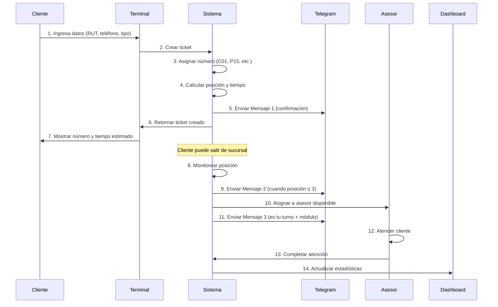

# Uso del Sistema - Ticketero Digital

**Proyecto:** Sistema de Gestión de Tickets con Notificaciones en Tiempo Real  
**Cliente:** Institución Financiera  
**Versión:** 1.0  
**Fecha:** Diciembre 2025

---

## 1. Introducción

El Sistema Ticketero Digital moderniza la experiencia de atención en sucursales bancarias mediante la digitalización completa del proceso de tickets, notificaciones automáticas vía Telegram, y un panel de monitoreo en tiempo real.

### 1.1 Beneficios Principales

- ✅ **Movilidad del Cliente:** Recibe notificaciones y puede salir de la sucursal
- ✅ **Transparencia:** Conoce su posición y tiempo estimado en tiempo real
- ✅ **Eficiencia Operacional:** Asignación automática y balanceada de clientes
- ✅ **Supervisión:** Panel de monitoreo para toma de decisiones

---

## 2. Canales del Sistema

### 2.1 Canal Usuario (Cliente)

**Acceso:** Terminal de autoservicio en sucursal

**Funcionalidades:**
- Crear ticket digital seleccionando tipo de atención
- Recibir notificaciones automáticas vía Telegram
- Consultar estado y posición del ticket en tiempo real
- Conocer tiempo estimado de espera

**Datos Requeridos:**
- RUT/ID Nacional (obligatorio)
- Número de teléfono (opcional, para notificaciones)
- Tipo de atención (CAJA, PERSONAL_BANKER, EMPRESAS, GERENCIA)

### 2.2 Canal Operador (Asesor/Ejecutivo)

**Acceso:** Sistema interno de la sucursal

**Funcionalidades:**
- Recibir asignaciones automáticas de tickets
- Cambiar estado (AVAILABLE, BUSY, OFFLINE)
- Completar atención de tickets
- Ver información del cliente asignado

**Estados del Operador:**
- **AVAILABLE:** Disponible para recibir nuevas asignaciones
- **BUSY:** Atendiendo un cliente (no recibe nuevas asignaciones)
- **OFFLINE:** No disponible (almuerzo, capacitación, etc.)

### 2.3 Canal Administrador (Supervisor)

**Acceso:** Dashboard web administrativo

**Funcionalidades:**
- Monitorear estado operacional en tiempo real
- Ver estadísticas por cola y asesor
- Gestionar estados de asesores
- Recibir alertas de situaciones críticas
- Consultar auditoría de eventos
- Exportar reportes operacionales

---

## 3. Flujo de Uso Principal

### 3.1 Flujo Completo de Atención



### 3.2 Pasos Detallados

**Paso 1-7: Creación del Ticket**
1. Cliente se acerca al terminal de autoservicio
2. Ingresa RUT/ID nacional (obligatorio)
3. Ingresa teléfono (opcional, para notificaciones)
4. Selecciona tipo de atención requerida
5. Sistema genera número único (ej: C05, P12, E03, G01)
6. Sistema calcula posición en cola y tiempo estimado
7. Cliente recibe comprobante con número de ticket

**Paso 8-11: Gestión de Espera**
8. Sistema monitorea automáticamente la posición del ticket
9. Cuando quedan 3 personas adelante, envía pre-aviso vía Telegram
10. Sistema asigna ticket al próximo asesor disponible
11. Cliente recibe notificación con número de módulo

**Paso 12-14: Atención y Finalización**
12. Cliente se dirige al módulo indicado
13. Asesor atiende al cliente
14. Al finalizar, asesor marca la atención como completada

---

## 4. Estados del Ticket

### 4.1 Ciclo de Vida del Ticket

```
EN_ESPERA → PROXIMO → ATENDIENDO → COMPLETADO
    ↓           ↓          ↓
CANCELADO   CANCELADO  NO_ATENDIDO
```

### 4.2 Descripción de Estados

| Estado | Descripción | Es Activo | Acciones del Cliente |
|--------|-------------|-----------|---------------------|
| **EN_ESPERA** | Esperando asignación a asesor | Sí | Puede salir de sucursal, recibirá notificaciones |
| **PROXIMO** | Próximo a ser atendido (≤3 en cola) | Sí | Debe acercarse a la sucursal |
| **ATENDIENDO** | Siendo atendido por un asesor | Sí | Debe estar en el módulo asignado |
| **COMPLETADO** | Atención finalizada exitosamente | No | Proceso terminado |
| **CANCELADO** | Cancelado por cliente o sistema | No | Puede crear nuevo ticket |
| **NO_ATENDIDO** | Cliente no se presentó cuando fue llamado | No | Puede crear nuevo ticket |

### 4.3 Transiciones de Estado

**Automáticas:**
- EN_ESPERA → PROXIMO (cuando posición ≤ 3)
- PROXIMO → ATENDIENDO (al asignar asesor)
- ATENDIENDO → COMPLETADO (asesor finaliza atención)
- ATENDIENDO → NO_ATENDIDO (cliente no se presenta)

**Manuales:**
- Cualquier estado activo → CANCELADO (cliente o supervisor)

---

## 5. Tipos de Cola y Prioridades

### 5.1 Configuración de Colas

| Cola | Tiempo Promedio | Prioridad | Prefijo | Descripción |
|------|-----------------|-----------|---------|-------------|
| **CAJA** | 5 minutos | 1 (baja) | C | Transacciones básicas, depósitos, retiros |
| **PERSONAL_BANKER** | 15 minutos | 2 (media) | P | Productos financieros, créditos, inversiones |
| **EMPRESAS** | 20 minutos | 3 (media-alta) | E | Clientes corporativos, cuentas empresariales |
| **GERENCIA** | 30 minutos | 4 (máxima) | G | Casos especiales, reclamos, situaciones complejas |

### 5.2 Reglas de Asignación

**Prioridad de Colas:**
- Cuando un asesor se libera, el sistema asigna primero tickets de GERENCIA, luego EMPRESAS, PERSONAL_BANKER, y finalmente CAJA

**Orden FIFO:**
- Dentro de cada cola, se respeta el orden de llegada (First In, First Out)

**Balanceo de Carga:**
- Entre asesores disponibles, se asigna al que tiene menor cantidad de tickets asignados

---

## 6. Sistema de Notificaciones

### 6.1 Mensajes Automáticos vía Telegram

**Requisito:** Cliente debe proporcionar número de teléfono al crear ticket

#### Mensaje 1: Confirmación de Creación
```
✅ Ticket Creado

Tu número de turno: C05
Posición en cola: #5
Tiempo estimado: 25 minutos

Te notificaremos cuando estés próximo.
```
**Cuándo:** Inmediatamente al crear el ticket

#### Mensaje 2: Pre-aviso
```
⏰ ¡Pronto será tu turno!

Turno: C05
Faltan aproximadamente 3 turnos.

Por favor, acércate a la sucursal.
```
**Cuándo:** Cuando la posición en cola es ≤ 3

#### Mensaje 3: Turno Activo
```
🔔 ¡ES TU TURNO C05!

Dirígete al módulo: 3
Asesor: Juan Pérez
```
**Cuándo:** Al asignar el ticket a un asesor

### 6.2 Manejo de Fallos

**Reintentos Automáticos:**
- Si un mensaje falla, el sistema reintenta hasta 3 veces adicionales
- Intervalos: 30s, 60s, 120s (backoff exponencial)
- Tras 4 intentos fallidos, se marca como FALLIDO

---

## 7. Comportamiento Esperado del Sistema

### 7.1 Rendimiento

**Tiempos de Respuesta:**
- Creación de ticket: < 2 segundos
- Consulta de estado: < 1 segundo
- Asignación automática: < 5 segundos
- Actualización de dashboard: cada 5 segundos

**Capacidad:**
- Hasta 1000 tickets activos simultáneos
- Soporte para 50 asesores concurrentes
- 10,000 tickets por día

### 7.2 Disponibilidad

**Horario de Operación:**
- Lunes a Viernes: 8:00 AM - 6:00 PM
- Sábados: 9:00 AM - 1:00 PM
- Domingos y festivos: Sistema inactivo

**Alta Disponibilidad:**
- 99.9% de uptime durante horario operativo
- Recuperación automática ante fallos
- Respaldo de datos cada 15 minutos

### 7.3 Seguridad

**Protección de Datos:**
- Encriptación de datos sensibles
- Logs de auditoría inmutables
- Acceso basado en roles (Cliente/Operador/Administrador)

**Validaciones:**
- RUT/ID con dígito verificador
- Formato de teléfono internacional
- Sanitización de inputs

### 7.4 Escalabilidad

**Crecimiento Horizontal:**
- Múltiples instancias de aplicación
- Base de datos con réplicas de lectura
- Cache distribuido para consultas frecuentes

**Alertas Automáticas:**
- Cola saturada (>10 tickets esperando)
- Tiempo de espera excesivo (>60 minutos)
- Asesor offline inesperadamente
- Fallos de notificaciones

---

## 8. Casos de Uso Comunes

### 8.1 Cliente Típico

**Escenario:** Cliente necesita atención en Personal Banker

1. **Llegada:** Se acerca al terminal de autoservicio
2. **Registro:** Ingresa RUT "12345678-9" y teléfono "+56912345678"
3. **Selección:** Elige "Personal Banker"
4. **Confirmación:** Recibe ticket P08 con 45 minutos de espera
5. **Movilidad:** Sale de la sucursal, recibe Mensaje 1 por Telegram
6. **Pre-aviso:** 40 minutos después recibe Mensaje 2 (quedan 3 turnos)
7. **Regreso:** Vuelve a la sucursal
8. **Atención:** Recibe Mensaje 3 con módulo 2, asesor Ana López
9. **Finalización:** Completa su trámite exitosamente

### 8.2 Supervisor Típico

**Escenario:** Monitoreo de operación en hora pico

1. **Acceso:** Ingresa al dashboard administrativo
2. **Revisión:** Ve 15 tickets en CAJA (alerta de saturación)
3. **Acción:** Cambia estado de asesor adicional a AVAILABLE
4. **Monitoreo:** Observa reducción gradual de la cola
5. **Análisis:** Revisa estadísticas de tiempo promedio por asesor
6. **Reporte:** Exporta métricas del día para análisis

### 8.3 Situación de Emergencia

**Escenario:** Fallo del sistema de notificaciones

1. **Detección:** Dashboard muestra alertas de mensajes fallidos
2. **Diagnóstico:** Supervisor identifica problema con API de Telegram
3. **Comunicación:** Personal informa a clientes sobre consulta manual
4. **Alternativa:** Clientes consultan estado en terminal
5. **Resolución:** Sistema reintenta envíos automáticamente
6. **Recuperación:** Notificaciones se normalizan gradualmente

---

## 9. Consultas y Monitoreo

### 9.1 Consulta de Estado (Cliente)

**Por Código de Referencia:**
```
GET /api/tickets/a1b2c3d4-e5f6-7g8h-9i0j-k1l2m3n4o5p6
```

**Por Número de Ticket:**
```
GET /api/tickets/C05/position
```

**Respuesta Típica:**
```json
{
  "numero": "C05",
  "status": "EN_ESPERA",
  "positionInQueue": 3,
  "estimatedWaitMinutes": 15,
  "queueType": "CAJA",
  "createdAt": "2025-12-15T09:30:00Z",
  "assignedAdvisor": null,
  "assignedModuleNumber": null
}
```

### 9.2 Dashboard Administrativo

**Resumen General:**
- Total de tickets del día
- Tickets en espera vs. siendo atendidos
- Tiempo promedio de espera global
- Hora pico de demanda

**Por Cola:**
- Cantidad esperando por tipo
- Tiempo promedio real vs. estimado
- Tickets completados en el día
- Estado: NORMAL, BUSY, CRITICAL

**Por Asesor:**
- Estado actual (AVAILABLE/BUSY/OFFLINE)
- Tickets atendidos en el día
- Tiempo promedio de atención
- Módulo asignado

---

## 10. Resolución de Problemas

### 10.1 Problemas Comunes del Cliente

**"No recibo notificaciones de Telegram"**
- Verificar que el teléfono esté correcto
- Confirmar que tiene cuenta de Telegram activa
- Consultar estado manualmente en terminal

**"Mi ticket no aparece"**
- Verificar código de referencia (UUID)
- Confirmar que el ticket no fue cancelado
- Contactar personal de la sucursal

**"El tiempo estimado no es correcto"**
- Los tiempos son estimaciones basadas en promedios
- Pueden variar según complejidad de casos
- Se actualizan automáticamente

### 10.2 Problemas Operacionales

**Cola Saturada (>10 tickets)**
- Habilitar asesores adicionales
- Redistribuir personal entre colas
- Comunicar demoras a clientes

**Asesor No Disponible**
- Verificar estado en dashboard
- Cambiar manualmente a AVAILABLE si es necesario
- Revisar conectividad del terminal del asesor

**Fallos de Notificaciones**
- Revisar conectividad con API de Telegram
- Verificar logs de reintentos
- Informar a clientes sobre consulta manual

---

## 11. Métricas y KPIs

### 11.1 Métricas Operacionales

**Eficiencia:**
- Tiempo promedio de espera por cola
- Tiempo promedio de atención por asesor
- Porcentaje de tickets completados vs. cancelados
- Tasa de no-presentación de clientes

**Calidad de Servicio:**
- Tiempo de respuesta del sistema
- Disponibilidad del servicio (uptime)
- Tasa de éxito de notificaciones
- Satisfacción del cliente (encuestas)

**Utilización de Recursos:**
- Porcentaje de tiempo BUSY por asesor
- Distribución de carga entre colas
- Horas pico de demanda
- Capacidad utilizada vs. disponible

### 11.2 Alertas Configuradas

| Alerta | Umbral | Severidad | Acción Recomendada |
|--------|--------|-----------|-------------------|
| Cola Saturada | >10 tickets | HIGH | Habilitar asesor adicional |
| Tiempo Excesivo | >60 min espera | CRITICAL | Redistribuir personal |
| Asesor Offline | Inesperadamente | MEDIUM | Verificar conectividad |
| Fallos Notificación | >50% fallidos | HIGH | Revisar API Telegram |
| Sistema Lento | >5s respuesta | CRITICAL | Revisar infraestructura |

---

## 12. Mantenimiento y Actualizaciones

### 12.1 Mantenimiento Programado

**Diario:**
- Reinicio de contadores de tickets (00:00 hrs)
- Respaldo de base de datos
- Limpieza de logs antiguos

**Semanal:**
- Análisis de métricas de rendimiento
- Revisión de alertas generadas
- Actualización de estadísticas históricas

**Mensual:**
- Optimización de base de datos
- Revisión de capacidad y escalabilidad
- Actualización de configuraciones

### 12.2 Actualizaciones del Sistema

**Ventana de Mantenimiento:**
- Domingos 2:00 AM - 6:00 AM
- Notificación previa de 48 horas
- Rollback automático en caso de fallo

**Tipos de Actualización:**
- Parches de seguridad (críticos)
- Mejoras de funcionalidad
- Optimizaciones de rendimiento
- Nuevas características

---

**Documento de Uso del Sistema completado**

**Versión:** 1.0  
**Última actualización:** Diciembre 2025  
**Próxima revisión:** Marzo 2026

Para soporte técnico o consultas adicionales, contactar al equipo de TI de la institución.